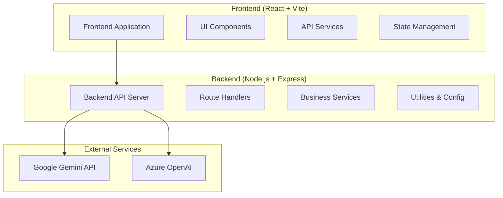

# Design Document

## Overview

현재 단일 프로젝트로 구성된 AI 가상 피팅 시스템을 백엔드와 프론트엔드로 분리하여 독립적인 개발, 배포, 확장이 가능한 구조로 재설계합니다. 이 설계는 마이크로서비스 아키텍처의 원칙을 따르되, 현재 기능을 유지하면서 점진적으로 전환할 수 있도록 합니다.

## Architecture

### High-Level Architecture



### Directory Structure

```
project-root/
├── backend/
│   ├── package.json
│   ├── src/
│   │   ├── app.js                 # Express app setup
│   │   ├── server.js              # Server entry point
│   │   ├── routes/
│   │   │   ├── index.js           # Route registry
│   │   │   ├── generate.js        # Virtual try-on routes
│   │   │   └── recommend.js       # Recommendation routes
│   │   ├── services/
│   │   │   ├── gemini.service.js  # Gemini AI service
│   │   │   ├── openai.service.js  # Azure OpenAI service
│   │   │   └── catalog.service.js # Product catalog service
│   │   ├── middleware/
│   │   │   ├── cors.js            # CORS configuration
│   │   │   ├── validation.js      # Request validation
│   │   │   └── error.js           # Error handling
│   │   ├── utils/
│   │   │   ├── config.js          # Environment configuration
│   │   │   └── logger.js          # Logging utility
│   │   └── types/
│   │       └── api.types.js       # API type definitions
│   ├── data/
│   │   └── catalog.json           # Product catalog
│   └── .env.example
├── frontend/
│   ├── package.json
│   ├── vite.config.ts
│   ├── src/
│   │   ├── main.tsx               # React entry point
│   │   ├── App.tsx                # Main app component
│   │   ├── components/
│   │   │   ├── ui/                # Reusable UI components
│   │   │   ├── features/          # Feature-specific components
│   │   │   └── layout/            # Layout components
│   │   ├── services/
│   │   │   ├── api.service.ts     # API client
│   │   │   └── types.ts           # TypeScript types
│   │   ├── hooks/
│   │   │   └── useApi.ts          # Custom API hooks
│   │   ├── utils/
│   │   │   └── constants.ts       # Constants and config
│   │   └── styles/
│   │       └── globals.css        # Global styles
│   └── .env.example
└── shared/
    └── types/
        └── api.types.ts           # Shared type definitions
```

## Components and Interfaces

### Backend Components

#### 1. Route Handlers (`routes/`)
- **Purpose**: HTTP request routing and basic validation
- **Responsibilities**: 
  - Route definition and parameter extraction
  - Input validation and sanitization
  - Response formatting
- **Interface**: Express.js router middleware pattern

#### 2. Business Services (`services/`)
- **Purpose**: Core business logic and external API integration
- **Responsibilities**:
  - AI service integration (Gemini, Azure OpenAI)
  - Data processing and transformation
  - Business rule enforcement
- **Interface**: Service classes with standardized methods

#### 3. Middleware (`middleware/`)
- **Purpose**: Cross-cutting concerns
- **Responsibilities**:
  - CORS handling
  - Request/response validation
  - Error handling and logging
- **Interface**: Express.js middleware functions

#### 4. Utilities (`utils/`)
- **Purpose**: Shared utilities and configuration
- **Responsibilities**:
  - Environment configuration management
  - Logging and monitoring
  - Helper functions
- **Interface**: Pure functions and configuration objects

### Frontend Components

#### 1. UI Components (`components/ui/`)
- **Purpose**: Reusable, presentational components
- **Examples**: Button, Input, Modal, Card
- **Interface**: React functional components with TypeScript props

#### 2. Feature Components (`components/features/`)
- **Purpose**: Business logic components
- **Examples**: VirtualTryOn, ProductRecommendation, ImageUploader
- **Interface**: React components with hooks for state management

#### 3. API Services (`services/`)
- **Purpose**: Backend communication
- **Responsibilities**:
  - HTTP client configuration
  - Request/response transformation
  - Error handling
- **Interface**: Service classes with async methods

#### 4. Custom Hooks (`hooks/`)
- **Purpose**: Reusable stateful logic
- **Examples**: useApi, useImageUpload, useVirtualTryOn
- **Interface**: React custom hooks

## Data Models

### API Request/Response Models

```typescript
// Shared types for API communication
interface ApiFile {
  base64: string;
  mimeType: string;
}

interface ClothingItems {
  top?: ApiFile | null;
  pants?: ApiFile | null;
  shoes?: ApiFile | null;
}

interface VirtualTryOnRequest {
  person: ApiFile;
  clothingItems: ClothingItems;
}

interface VirtualTryOnResponse {
  generatedImage: string;
  error?: string;
}

interface RecommendationRequest {
  person?: ApiFile;
  clothingItems?: ClothingItems;
  generatedImage?: string;
}

interface RecommendationResponse {
  recommendations: RecommendationItem[] | CategoryRecommendations;
  error?: string;
}

interface RecommendationItem {
  id: string;
  title: string;
  price: number;
  imageUrl?: string;
  score?: number;
  tags: string[];
  category: string;
}

interface CategoryRecommendations {
  top: RecommendationItem[];
  pants: RecommendationItem[];
  shoes: RecommendationItem[];
  accessories: RecommendationItem[];
}
```

### Frontend State Models

```typescript
// Frontend-specific state types
interface UploadedImage {
  file: File;
  previewUrl: string;
  base64: string;
  mimeType: string;
}

interface VirtualTryOnState {
  personImage: UploadedImage | null;
  clothingItems: {
    top: UploadedImage | null;
    pants: UploadedImage | null;
    shoes: UploadedImage | null;
  };
  generatedImage: string | null;
  recommendations: CategoryRecommendations | null;
  isLoading: boolean;
  error: string | null;
}
```

## Error Handling

### Backend Error Handling

```javascript
// Standardized error response format
class ApiError extends Error {
  constructor(message, statusCode = 500, code = 'INTERNAL_ERROR') {
    super(message);
    this.statusCode = statusCode;
    this.code = code;
  }
}

// Error middleware
const errorHandler = (err, req, res, next) => {
  const statusCode = err.statusCode || 500;
  const response = {
    error: {
      message: err.message,
      code: err.code || 'INTERNAL_ERROR',
      ...(process.env.NODE_ENV === 'development' && { stack: err.stack })
    }
  };
  
  res.status(statusCode).json(response);
};
```

### Frontend Error Handling

```typescript
// API service error handling
class ApiService {
  private async handleResponse<T>(response: Response): Promise<T> {
    if (!response.ok) {
      const errorData = await response.json().catch(() => ({}));
      throw new ApiError(
        errorData.error?.message || 'An error occurred',
        response.status,
        errorData.error?.code
      );
    }
    return response.json();
  }
}

// React error boundary for component errors
class ErrorBoundary extends React.Component {
  // Error boundary implementation
}
```

## Testing Strategy

### Backend Testing

1. **Unit Tests**: Service layer and utility functions
   - Test AI service integrations with mocked responses
   - Test data transformation logic
   - Test configuration management

2. **Integration Tests**: API endpoints
   - Test request/response flow
   - Test error handling scenarios
   - Test middleware functionality

3. **Contract Tests**: API schema validation
   - Validate request/response schemas
   - Test backward compatibility

### Frontend Testing

1. **Component Tests**: UI component behavior
   - Test component rendering
   - Test user interactions
   - Test prop handling

2. **Integration Tests**: Feature workflows
   - Test virtual try-on flow
   - Test recommendation display
   - Test error states

3. **E2E Tests**: Complete user journeys
   - Test image upload and processing
   - Test API integration
   - Test responsive design

## Configuration Management

### Backend Configuration

```javascript
// config.js
const config = {
  server: {
    port: process.env.PORT || 3000,
    cors: {
      origin: process.env.FRONTEND_URL || 'http://localhost:5173',
      credentials: true
    }
  },
  ai: {
    gemini: {
      apiKey: process.env.GEMINI_API_KEY,
      model: 'gemini-2.5-flash-image-preview'
    },
    azure: {
      endpoint: process.env.AZURE_OPENAI_ENDPOINT,
      apiKey: process.env.AZURE_OPENAI_KEY,
      deploymentId: process.env.AZURE_OPENAI_DEPLOYMENT_ID
    }
  },
  upload: {
    maxSize: '10mb',
    allowedTypes: ['image/jpeg', 'image/png', 'image/webp']
  }
};
```

### Frontend Configuration

```typescript
// constants.ts
export const API_CONFIG = {
  baseUrl: import.meta.env.VITE_API_URL || 'http://localhost:3000',
  timeout: 30000,
  retries: 3
};

export const UPLOAD_CONFIG = {
  maxSize: 10 * 1024 * 1024, // 10MB
  allowedTypes: ['image/jpeg', 'image/png', 'image/webp'],
  quality: 0.8
};
```

## Migration Strategy

### Phase 1: Project Structure Setup
1. Create separate backend and frontend directories
2. Split package.json files
3. Configure build and development scripts
4. Set up environment configurations

### Phase 2: Backend Refactoring
1. Extract route handlers from server.js
2. Create service layer for AI integrations
3. Implement middleware for cross-cutting concerns
4. Add comprehensive error handling

### Phase 3: Frontend Refactoring
1. Reorganize components into feature-based structure
2. Create API service layer
3. Implement custom hooks for state management
4. Add TypeScript types and interfaces

### Phase 4: API Standardization
1. Define OpenAPI/Swagger specifications
2. Implement request/response validation
3. Add API versioning support
4. Create shared type definitions

### Phase 5: Testing and Documentation
1. Add comprehensive test suites
2. Set up CI/CD pipelines
3. Create API documentation
4. Add deployment configurations

## Deployment Considerations

### Backend Deployment
- **Container**: Docker container with Node.js runtime
- **Environment**: Environment variables for configuration
- **Health Checks**: `/health` endpoint for monitoring
- **Scaling**: Horizontal scaling with load balancer

### Frontend Deployment
- **Static Hosting**: CDN deployment (Vercel, Netlify, AWS S3)
- **Build Optimization**: Code splitting and tree shaking
- **Environment**: Build-time environment variable injection
- **Caching**: Aggressive caching with cache busting

### Development Workflow
- **Local Development**: Concurrent backend and frontend servers
- **Hot Reload**: Vite HMR for frontend, nodemon for backend
- **Proxy Setup**: Vite proxy for API calls during development
- **Environment Sync**: Shared environment variable management