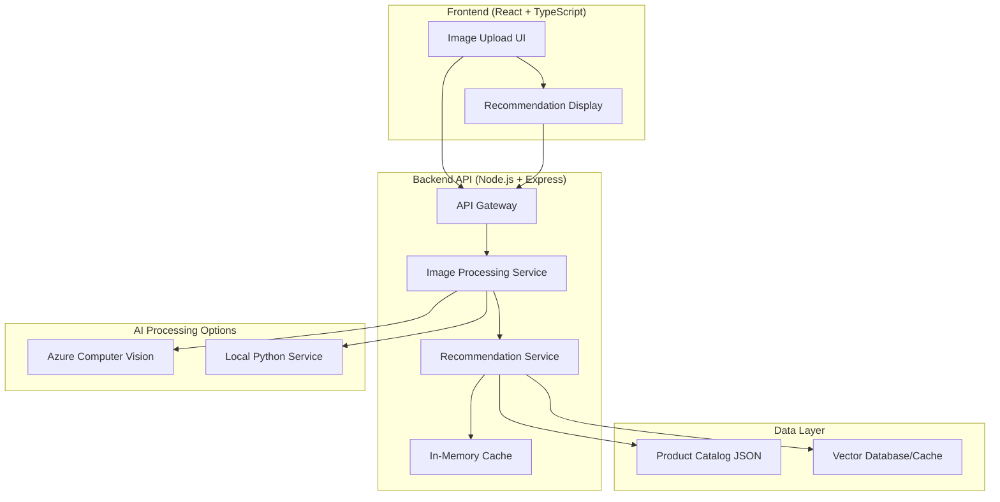
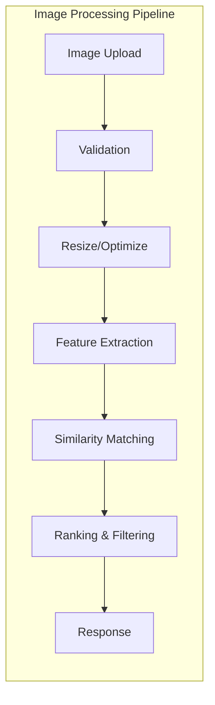
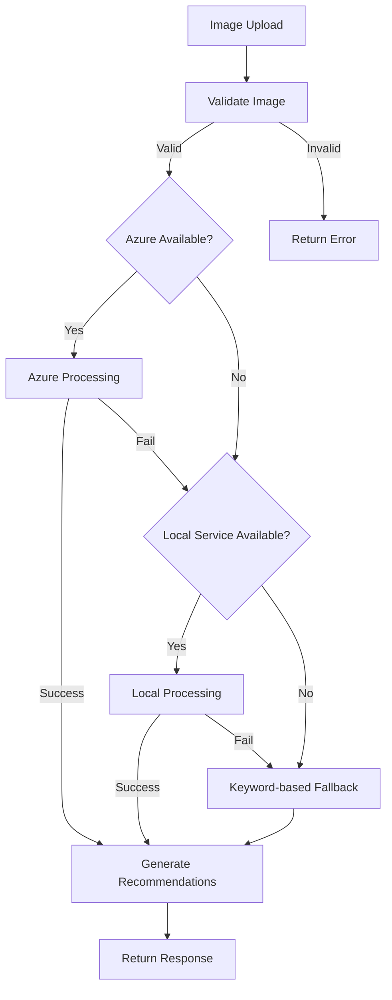

# Design Document

## Overview

이 문서는 이미지 기반 패션 아이템 추천 시스템의 설계를 다룹니다. 현재 키워드 매칭 기반의 단순한 추천 시스템을 시각적 유사성 기반의 고도화된 시스템으로 발전시킵니다. Azure Cognitive Services와 로컬 Python 벡터 임베딩을 모두 지원하며, 이미지를 서버에 저장하지 않고 메모리에서 처리하는 효율적인 아키텍처를 구현합니다.

## Architecture

### High-Level Architecture



### Service Architecture



## Components and Interfaces

### 1. Image Processing Service

**Location:** `backend/src/services/imageProcessingService.js`

```javascript
class ImageProcessingService {
    async processImage(imageData, options = {}) {
        // Validates and preprocesses image
        // Returns processed image data for AI analysis
    }
    
    async extractFeatures(imageData, provider = 'auto') {
        // Extracts visual features using Azure or local processing
        // Returns feature vector and metadata
    }
    
    async categorizeClothing(imageData) {
        // Identifies clothing categories in the image
        // Returns categories with confidence scores
    }
}
```

**Key Features:**
- Image validation and preprocessing
- Memory-only processing (no disk storage)
- Support for multiple image formats
- Automatic fallback between providers

### 2. Azure Computer Vision Integration

**Location:** `backend/src/services/azureVisionService.js`

```javascript
class AzureVisionService {
    async analyzeImage(imageBase64, options = {}) {
        // Calls Azure Computer Vision API
        // Returns detailed image analysis
    }
    
    async extractVisualFeatures(imageBase64) {
        // Extracts visual features using Azure
        // Returns feature vector for similarity matching
    }
    
    async detectClothingItems(imageBase64) {
        // Detects and categorizes clothing items
        // Returns bounding boxes and categories
    }
}
```

**Configuration:**
```javascript
const azureConfig = {
    endpoint: process.env.AZURE_COMPUTER_VISION_ENDPOINT,
    apiKey: process.env.AZURE_COMPUTER_VISION_KEY,
    apiVersion: '2023-10-01',
    features: ['Categories', 'Tags', 'Objects', 'Color']
};
```

### 3. Local Python Vector Service

**Location:** `backend/src/services/localVectorService.js`

```javascript
class LocalVectorService {
    async startPythonService() {
        // Starts Python subprocess for vector processing
        // Manages process lifecycle
    }
    
    async extractFeatures(imageBase64) {
        // Sends image to Python service via IPC
        // Returns feature vector from CLIP/ResNet model
    }
    
    async computeSimilarity(queryVector, catalogVectors) {
        // Computes cosine similarity between vectors
        // Returns ranked similarity scores
    }
}
```

**Python Service:** `backend/python/vector_service.py`

```python
import clip
import torch
from PIL import Image
import base64
import json
import sys

class VectorService:
    def __init__(self):
        self.device = "cuda" if torch.cuda.is_available() else "cpu"
        self.model, self.preprocess = clip.load("ViT-B/32", device=self.device)
    
    def extract_features(self, image_base64):
        # Processes image and extracts CLIP features
        # Returns normalized feature vector
        
    def compute_similarity(self, query_vector, catalog_vectors):
        # Computes cosine similarity
        # Returns sorted similarity scores
```

### 4. Recommendation Engine

**Location:** `backend/src/services/recommendationService.js`

```javascript
class RecommendationService {
    async getRecommendations(imageFeatures, options = {}) {
        // Main recommendation logic
        // Combines visual similarity with business rules
    }
    
    async findSimilarItems(queryVector, category = null) {
        // Finds visually similar items in catalog
        // Filters by category if specified
    }
    
    async rankRecommendations(candidates, userPreferences = {}) {
        // Applies ranking algorithm
        // Considers price, popularity, availability
    }
    
    async categorizeRecommendations(recommendations) {
        // Groups recommendations by clothing category
        // Returns structured response
    }
}
```

### 5. Vector Database/Cache

**Location:** `backend/src/services/vectorCacheService.js`

```javascript
class VectorCacheService {
    constructor() {
        this.cache = new Map(); // In-memory cache for development
        this.catalogVectors = new Map(); // Pre-computed catalog vectors
    }
    
    async getCatalogVectors() {
        // Returns pre-computed vectors for all catalog items
        // Lazy loads if not cached
    }
    
    async computeCatalogVectors() {
        // Pre-computes vectors for all catalog items
        // Runs on server startup or catalog update
    }
    
    async findSimilar(queryVector, threshold = 0.7) {
        // Performs similarity search
        // Returns items above similarity threshold
    }
}
```

### 6. API Endpoints

**Enhanced Recommendation API:**

```javascript
// POST /api/recommend-visual
{
    "image": "data:image/jpeg;base64,...",
    "options": {
        "provider": "azure|local|auto",
        "categories": ["top", "pants", "shoes"],
        "maxResults": 10,
        "minSimilarity": 0.7
    }
}

// Response
{
    "success": true,
    "processingTime": 1.2,
    "provider": "azure",
    "recommendations": {
        "top": [
            {
                "id": "p001",
                "title": "블랙 오버사이즈 후드티",
                "price": 42000,
                "similarity": 0.89,
                "category": "top",
                "imageUrl": "https://example.com/p001.jpg",
                "features": {
                    "color": "black",
                    "style": "casual",
                    "pattern": "solid"
                }
            }
        ],
        "pants": [...],
        "shoes": [...],
        "accessories": [...]
    },
    "metadata": {
        "detectedCategories": ["top", "casual"],
        "dominantColors": ["black", "gray"],
        "confidence": 0.92
    }
}
```

## Data Models

### Image Processing Models

```typescript
interface ImageData {
    base64: string;
    mimeType: string;
    width?: number;
    height?: number;
    size?: number;
}

interface ProcessedImage {
    data: ImageData;
    features: FeatureVector;
    metadata: ImageMetadata;
    processingTime: number;
    provider: 'azure' | 'local';
}

interface FeatureVector {
    vector: number[];
    dimensions: number;
    model: string;
    version: string;
}

interface ImageMetadata {
    detectedObjects: DetectedObject[];
    dominantColors: Color[];
    categories: Category[];
    confidence: number;
}

interface DetectedObject {
    category: string;
    confidence: number;
    boundingBox?: BoundingBox;
}
```

### Recommendation Models

```typescript
interface RecommendationRequest {
    image: ImageData;
    options: RecommendationOptions;
}

interface RecommendationOptions {
    provider?: 'azure' | 'local' | 'auto';
    categories?: string[];
    maxResults?: number;
    minSimilarity?: number;
    priceRange?: [number, number];
    brands?: string[];
}

interface RecommendationResponse {
    success: boolean;
    processingTime: number;
    provider: string;
    recommendations: CategorizedRecommendations;
    metadata: RecommendationMetadata;
}

interface CategorizedRecommendations {
    top: RecommendationItem[];
    pants: RecommendationItem[];
    shoes: RecommendationItem[];
    accessories: RecommendationItem[];
}

interface RecommendationItem {
    id: string;
    title: string;
    price: number;
    similarity: number;
    category: string;
    imageUrl?: string;
    features: ItemFeatures;
    availability?: boolean;
    brand?: string;
}
```

### Enhanced Catalog Model

```typescript
interface CatalogItem {
    id: string;
    title: string;
    description?: string;
    price: number;
    originalPrice?: number;
    discount?: number;
    brand: string;
    category: string;
    subcategory?: string;
    tags: string[];
    colors: string[];
    sizes: string[];
    imageUrl: string;
    imageUrls?: string[];
    features: ItemFeatures;
    vector?: FeatureVector;
    availability: boolean;
    popularity?: number;
    rating?: number;
    reviewCount?: number;
}

interface ItemFeatures {
    color: string;
    style: string;
    pattern: string;
    material?: string;
    fit?: string;
    season?: string;
}
```

## Error Handling

### Error Types and Responses

```javascript
class ImageProcessingError extends Error {
    constructor(message, code, details = {}) {
        super(message);
        this.name = 'ImageProcessingError';
        this.code = code;
        this.details = details;
    }
}

// Error Codes
const ERROR_CODES = {
    INVALID_IMAGE: 'INVALID_IMAGE',
    IMAGE_TOO_LARGE: 'IMAGE_TOO_LARGE',
    UNSUPPORTED_FORMAT: 'UNSUPPORTED_FORMAT',
    AZURE_SERVICE_ERROR: 'AZURE_SERVICE_ERROR',
    LOCAL_SERVICE_ERROR: 'LOCAL_SERVICE_ERROR',
    VECTOR_COMPUTATION_ERROR: 'VECTOR_COMPUTATION_ERROR',
    RECOMMENDATION_ERROR: 'RECOMMENDATION_ERROR'
};
```

### Fallback Strategy



## Testing Strategy

### Unit Tests

```javascript
// Image Processing Service Tests
describe('ImageProcessingService', () => {
    test('should validate image format', async () => {
        const service = new ImageProcessingService();
        const validImage = 'data:image/jpeg;base64,...';
        const result = await service.validateImage(validImage);
        expect(result.isValid).toBe(true);
    });
    
    test('should handle invalid image gracefully', async () => {
        const service = new ImageProcessingService();
        const invalidImage = 'invalid-data';
        await expect(service.processImage(invalidImage))
            .rejects.toThrow(ImageProcessingError);
    });
});

// Recommendation Service Tests
describe('RecommendationService', () => {
    test('should return categorized recommendations', async () => {
        const service = new RecommendationService();
        const mockFeatures = { vector: [0.1, 0.2, 0.3], dimensions: 3 };
        const result = await service.getRecommendations(mockFeatures);
        
        expect(result.recommendations).toHaveProperty('top');
        expect(result.recommendations).toHaveProperty('pants');
        expect(result.recommendations).toHaveProperty('shoes');
    });
});
```

### Integration Tests

```javascript
// API Integration Tests
describe('Recommendation API', () => {
    test('POST /api/recommend-visual should return recommendations', async () => {
        const response = await request(app)
            .post('/api/recommend-visual')
            .send({
                image: 'data:image/jpeg;base64,...',
                options: { maxResults: 5 }
            });
            
        expect(response.status).toBe(200);
        expect(response.body.success).toBe(true);
        expect(response.body.recommendations).toBeDefined();
    });
});
```

### Performance Tests

```javascript
// Load Testing
describe('Performance Tests', () => {
    test('should handle concurrent requests', async () => {
        const requests = Array(10).fill().map(() => 
            request(app)
                .post('/api/recommend-visual')
                .send({ image: mockImageData })
        );
        
        const responses = await Promise.all(requests);
        responses.forEach(response => {
            expect(response.status).toBe(200);
            expect(response.body.processingTime).toBeLessThan(10);
        });
    });
});
```

## Performance Considerations

### Optimization Strategies

1. **Vector Caching:**
   - Pre-compute vectors for all catalog items
   - Cache frequently requested image features
   - Use Redis for distributed caching in production

2. **Image Processing:**
   - Resize images to optimal dimensions (224x224 for CLIP)
   - Compress images before processing
   - Implement request queuing for high load

3. **Similarity Search:**
   - Use approximate nearest neighbor (ANN) algorithms
   - Implement vector indexing (FAISS, Annoy)
   - Batch similarity computations

4. **API Response:**
   - Implement response compression
   - Use CDN for catalog images
   - Implement pagination for large result sets

### Monitoring and Metrics

```javascript
// Performance Metrics
const metrics = {
    imageProcessingTime: histogram('image_processing_duration_seconds'),
    recommendationAccuracy: gauge('recommendation_accuracy_score'),
    apiResponseTime: histogram('api_response_duration_seconds'),
    errorRate: counter('api_errors_total'),
    cacheHitRate: gauge('cache_hit_rate')
};
```

## Security Considerations

### Data Privacy
- Images processed in memory only, never stored
- Automatic cleanup of temporary data
- No logging of sensitive image data

### API Security
- Rate limiting on image upload endpoints
- Input validation and sanitization
- CORS configuration for frontend access

### Service Security
- Secure API key management for Azure services
- Process isolation for Python services
- Error message sanitization to prevent information leakage