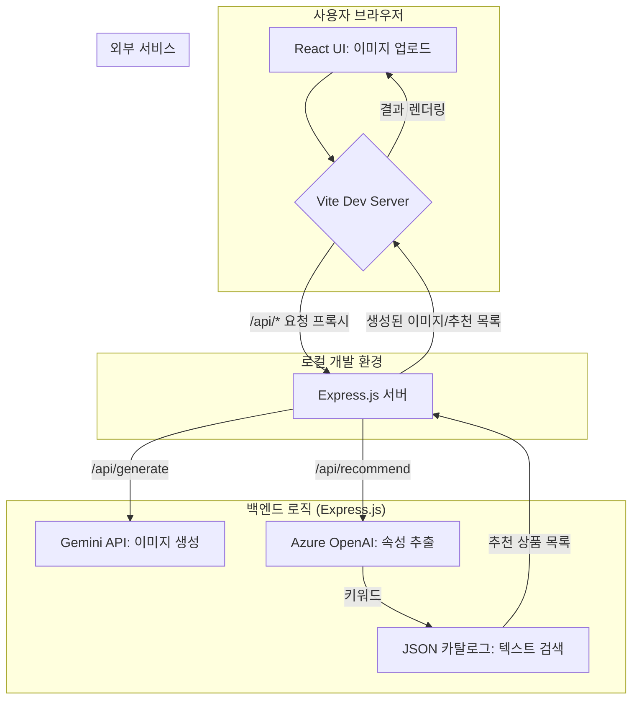

# 프로젝트 개요

이 문서는 AI 기반 가상 피팅 및 상품 추천 시스템의 아키텍처와 구현 계획을 설명합니다. 사용자가 자신의 사진과 옷 사진을 업로드하면, 가상으로 옷을 입어본 이미지를 생성하고, 업로드한 옷과 유사한 상품을 쇼핑몰 카탈로그에서 추천합니다.

## 주요 기능

1.  **가상 피팅 이미지 생성**: 사용자가 제공한 인물 사진과 의류 이미지를 결합하여, 해당 인물이 그 옷을 입은 것 같은 사실적인 이미지를 생성합니다.
2.  **유사 상품 추천**: 사용자가 업로드한 의류 이미지를 분석하여, 쇼핑몰의 상품 데이터베이스 내에서 스타일, 색상, 패턴 등이 유사한 상품들을 추천합니다.

## 아키텍처 (MVP)

MVP(Minimum Viable Product) 단계에서는 빠른 구현과 검증을 위해 아래와 같은 간단한 아키텍처를 채택합니다.

### 구성 요소

-   **프론트엔드**: React와 Vite를 사용하여 구축된 SPA(Single Page Application). 사용자는 이 UI를 통해 이미지를 업로드하고 결과를 확인합니다.
-   **백엔드 서버**: Node.js와 Express 프레임워크로 구성된 간단한 API 서버. 프론트엔드의 요청을 받아 외부 AI 서비스를 호출하고, 비즈니스 로직을 처리합니다.
-   **AI 서비스 (이미지 생성)**: Google Gemini API를 사용하여 가상 피팅 이미지를 생성합니다.
-   **AI 서비스 (상품 추천)**:
    -   **속성 추출**: Azure OpenAI Service를 사용하여 업로드된 의류 이미지에서 '검은색', '후드티', '오버사이즈'와 같은 텍스트 키워드를 추출합니다.
    -   **상품 매칭**: 로컬에 저장된 `catalog.json` 파일에서 추출된 키워드와 일치하는 상품을 검색하여 반환합니다.
-   **데이터베이스**: MVP 단계에서는 별도의 DB 없이 로컬 `catalog.json` 파일을 사용하여 상품 정보를 관리합니다.

## 보안

-   **API 키 관리**: 모든 외부 서비스(Gemini, Azure OpenAI)의 API 키는 `.env` 파일에 저장하고, `.gitignore`에 추가하여 Git 저장소에 노출되지 않도록 합니다. 백엔드 서버에서만 이 키를 로드하여 사용하며, 프론트엔드에는 절대 전송하지 않습니다.
-   **프로덕션 환경**: 실제 배포 시에는 Azure Key Vault와 Managed Identity를 사용하여 API 키를 안전하게 관리하는 것을 권장합니다.

## 향후 확장 계획

-   **벡터 데이터베이스 도입**: 텍스트 기반 검색의 한계를 극복하기 위해, Azure Cognitive Search와 같은 벡터 데이터베이스를 도입합니다. 모든 카탈로그 상품 이미지를 미리 임베딩(벡터화)하여 저장하고, 사용자 업로드 이미지의 벡터와 비교하여 시각적으로 더 유사한 상품을 빠르고 정확하게 찾을 수 있습니다.
-   **비동기 처리**: 이미지 처리 및 AI 모델 호출은 시간이 오래 걸릴 수 있으므로, Azure Queue Storage나 Service Bus 같은 메시지 큐를 도입하여 요청을 비동기적으로 처리하고 사용자 경험을 개선합니다.
-   **인프라 확장**: 사용자 트래픽 증가에 대비하여 Azure App Service, AKS(Azure Kubernetes Service) 등을 사용하여 백엔드 서비스를 확장 가능한 구조로 전환합니다.
